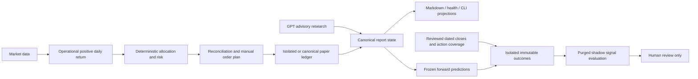

# Meridian Alpha Phase 4 acceptance and recovery checkpoint

## STATUS

**PARTIAL_COMPLETE — engineering checkpoint, not financial alpha validation.**
Verified new contracts and deterministic signal evaluation are implemented.
Full portfolio walk-forward/cost simulation, sealed native-role ablation and
qualified real comparison samples remain outstanding. No ten-hour execution
claim is made. Work began 2026-10-08 03:45 UTC (11:45 Asia/Shanghai); exact final
duration and delivery checks are recorded at final handoff.

## BASELINE / FINAL HEAD

Start: `414d8698a905b14eaea558490a5f30d995d07b9d`, fetched and matched to
`origin/codex/canonical-truth-hardening`. Default branch `main` was five commits
behind that development branch. Raw baseline CI logs confirmed Windows 730
passed and Ubuntu 728 passed plus two platform skips. A new independent remote
baseline clone reproduced **727 passed, three failed** in 99.19 seconds because
offline acceptance used closed-market wall time. The new clock fixture repairs
those failures; gates were not relaxed.

Latest validated code HEAD: `bd2e6dd0c67580bb8fefb414cc49d2590aa6ff94`.
Final delivery HEAD is the branch tip containing this report/checkpoint; remote
verification is recorded separately to avoid a self-referential commit hash.

## BRANCH / COMMITS

`feature/forward-evidence-alpha-lab-20261008`, based on the existing development
branch. No main merge or historical rewrite.

- `ffa7922`: deterministic offline clock, workspace temp and worktree isolation.
- `e84ad0e`: reviewed forward close adapter, isolated alpha laboratory and tests.
- `bd2e6dd`: actual decision attribution, canonical/health/Markdown projections.
- Audit/soak/documentation delivery commit follows these code commits.

## ACTUAL WORK COMPLETED

Reviewed forward, historical, corporate action, calendar, daily allocation/risk/
reconciliation/order and research authorization paths; reviewed ADR 0032–0034,
raw CI logs, current docs and all fetched origin-ref history patterns. Added
typed close review/ingestion, deterministic challengers, temporal purge and
descriptive paired signal evaluation. Added 57 regressions across laboratory
and decision-attribution modules. Preserved the concurrent quant-engine worktree.

## CANONICAL SAFETY

Schwab-Paper / PAPER, broker submission DISABLED, LLM authority ADVISORY_ONLY,
automatic promotion DISABLED. No canonical runtime write, reset, report
replacement, cache mutation, credential discovery or HSBC access. The only
canonical-state operation was a read-only aggregate forward-evidence inspection.
Public quotes remain BLOCKED for execution certification.

## FORWARD CLOSE ADAPTER

`DatedClose` validates symbol, 2026–2028 defined session close, USD price,
source/publication/receipt timestamps, origin and adjustment basis.
`ReviewedPricePair` binds prediction, inception, asset/benchmark closes and action
coverage to a digest and manual receipt. Public downloads and synthetic fixtures
never qualify by provider name. Late delivery is valid only after availability,
receipt and review. The read-only module CLI reconciles v1/v2 ledgers and retains
legacy unverified outcomes instead of hiding them.

## CORPORATE ACTION SUPPORT

Split/reverse split and cash/special dividend have chronological share-and-cash
holding-period semantics, without reinvestment. Asset and benchmark need full
coverage. Unknown adjustments, same-instant event ambiguity, unresolved symbol
change, suspension and delisting block return calculation. No inferred terminal
distribution or fabricated delisting price. Manual coverage remains a trust
attestation, not an authenticated official-feed certificate.

## FORWARD EVIDENCE STATUS / SAMPLE SUFFICIENCY

At read-only cutoff 2026-10-08 04:38 UTC: **40 predictions, 16 matured, 16
unverified outcomes, 24 pending, zero verified/reviewed outcomes**. All predictions
had session maturity and benchmark inception; all LLM scores were null.
Sixteen reviewed close receipts were missing. No qualifying data was imported.
Status **INSUFFICIENT_EVIDENCE**; no evaluation eligibility or promotion.
Symbol/horizon row count is not independent temporal or portfolio sample count.

## NO_ACTION ROOT-CAUSE ANALYSIS

Operational raw score is `max(0, daily_return)`, confidence is deterministic 1.
GPT consultation does not modify the operational score/target. Allocation caps
positions without redistributing unused capacity; all operational symbols share
the explicit unclassified risk sector. Tests demonstrate positive quant signals
can lose all allocation under that aggregate sector cap. Other demonstrated
causes: nonpositive signal, incomplete limit-price inputs, cash reserve, whole
shares and minimum notional. Traces record actual branches and risk violations.
Historical frequency/dominant cause remains NOT_VERIFIED; no fabricated
counterfactual or claim that successful GPT invocation changed quantities.

## ALPHA CHALLENGERS / BASELINE VS CHALLENGER

Fixed cash, exact operational score, 21-consecutive-session multi-factor and
quant plus existing certified research modifier. All are isolated signal
experiments without orders or authority. Missing/irregular/unknown-adjustment
history refuses multi-factor output; uncertified/absent LLM contributes zero.
Recipe, data/research digests and experiment digest are recorded. Six structured
daily-decision scenarios compared against the independent original baseline
produced **identical financial decisions**, including targets and order drafts.

## RESEARCH ABLATION

No new model invocation or paid API experiment. Existing certificate gates are
reused; native role-to-lab sealed ablation integration is outstanding. Fundamental,
Skeptic and Scenario comparative datasets are NOT_RUN. Token usage/cost UNKNOWN;
no independent role timing or confidence-as-probability is fabricated.

## WALK-FORWARD VALIDATION / LOOKAHEAD / SURVIVORSHIP AUDIT

Implemented label availability purge, strict cutoff rejection, ex-ante experiment
and fixed-universe timestamp checks, matching frozen baseline score, common
asset/benchmark/horizon and complete cross-sections. Deterministic overlap purge
is tested. Registration/universe times are caller attestations; no authenticated
registry or market-wide historical membership proof exists. Calendar scope is
explicitly bounded; exceptional older closures are not certified. Non-overlap
alone does not prove time-series independence. Full train/validation/test
portfolio simulation, cost/slippage sensitivity and authenticated registration
remain unfinished.

## EVALUATION RESULTS / DATA QUALITY

**NO_DEMONSTRATED_ALPHA / INSUFFICIENT_EVIDENCE.** Real financial sample count is
zero. Rank correlation and directional hit rate are descriptive signal metrics,
tested with mock review fixtures. No portfolio cumulative/annualized return,
Sharpe, turnover, drawdown, uncertainty interval or strategy ranking is claimed.
Missing execution/cost assumptions remain NOT_EVALUABLE. Ordinary research
confidence is not a probability, so Brier/ECE is NOT_APPLICABLE.
See [the evaluation report](2026-10-08-quant-vs-llm-shadow-evaluation.md).

## PERFORMANCE / SLO / RESEARCH COST & LATENCY

Sixteen offline fixture cycles across the autumn DST transition covered uptrend,
drawdown, sideways, incomplete quote, stale market/account and zero/small capital.
Zero failures/unexpected exceptions; repeat decisions and report projections
matched. Recorded individual total/report-persistence latency, traced current
209803 bytes and peak 311400 bytes. These are bounded fixture measurements, not
production latency/SLO or a memory trend. Provider/native research latency and
public-network cost benchmarks are NOT_MEASURED. No optimization speedup claimed.

## TEST RESULTS / END-TO-END ACCEPTANCE / RELIABILITY

Updated host validation: **787 passed**, 84.18 seconds; Ruff PASS, Pyright basic
0 errors/0 warnings, dependency integrity PASS, CLI PASS. Fifty-seven new lab/
attribution cases include receipt tampering, exact maturity, dividend/split,
missing/unknown/unresolved evidence, timestamp corruption, crash/retry,
cross-process writer contention, holidays/DST, temporal purge and projections.
Existing failure-injection suites remain included. Safe paper acceptance PASS
under optimized Python: NO_ACTION/zero fills and a clearly synthetic fill
fixture, duplicate ownership, complete report bundle and fresh-process check.
No skip/xfail/assertion weakening; three baseline tests gained an explicit
first-run PAPER_READY assertion. Pyright basic excludes scripts and cannot prove
runtime data quality; scripts also received executable smoke checks.

## FRESH CLONE

Baseline independent GitHub clone/lock installation completed; baseline clock
failures recorded above. Final new-branch fresh clone and full validation:
**PENDING** at this report checkpoint. UV installation under Windows sandbox hit
cache/PE ACL failures; host installation into a workspace-owned isolated cache
completed. No production runtime fallback was attempted.

## CI

Raw baseline run [37672422195](https://github.com/SiriZhao/meridian-alpha/actions/runs/37672422195)
was successful on Windows/Ubuntu. The two Ubuntu skips are explicitly Windows
PowerShell 5 launcher and Windows packaging tests; Windows executes both.
Latest new-branch CI: **PENDING**. Historical green is not latest-HEAD acceptance.

## GITHUB / PR / REMOTE READ-WRITE

Repository public and default branch main verified through GitHub. Fetch/clone
read access PASS. Push, final remote SHA and draft stacked PR: **PENDING**.
PR base must remain `codex/canonical-truth-hardening`; do not merge main.

## SECURITY REVIEW

Read-only audit scanned 1851 objects / 1110 blobs across fetched origin refs.
No high-risk token/private-key pattern finding. Two raw-account-field matches
are test fixture files. Seven historical blobs contain personal absolute paths,
including an old tracked temporary test report. Current tracked files contained
no personal-path match. Pattern scanning is not proof of no secret; findings
were fingerprinted without printing matched values. Manual privacy review is
recommended; no visibility change, secret-store access or history rewrite.

## UNRESOLVED RISKS / LIMITATIONS & BLOCKERS

Real qualified close/action/research comparison data unavailable; portfolio
simulator, native ablation and full production observability soak unfinished.
Review and experiment registration rely on local human attestations. No new
canonical approved-host daily acceptance was requested/executed in this phase:
**NOT_VERIFIED**. Ten-hour mission remains incomplete; use the
[machine-readable checkpoint](2026-10-08-phase4-checkpoint.json) to resume.

## PRODUCTION POLICY CHANGES

**NONE.** No allocation, scoring, threshold, sizing, risk limit, quote authority
or broker permission change. New observations/projections and isolated research
contracts only. Structured baseline comparison passed for six financial paths.

## REAL BROKER SIDE EFFECTS

**NONE.** No broker order/fill/mutation, credential discovery, canonical account
reset, holdings inference or production report replacement. Synthetic fixtures
remain confined to task-created temporary runtimes.

## NEXT DEVELOPMENT PRIORITIES / REQUIRED ANSWERS

1. Stable engineering baseline: current source validation PASS; final clone/CI/
   push acceptance still pending at this checkpoint.
2. Objective current-strategy investment evaluation: **INSUFFICIENT_EVIDENCE**;
   descriptive framework exists, qualified portfolio outcomes do not.
3. Pure Quant vs Quant+LLM real comparison: **INSUFFICIENT_EVIDENCE**, no real
   reviewed samples or scored LLM cohort.
4. Long NO_ACTION: observed candidate branches listed above; historical dominant
   frequency **NOT_VERIFIED**.
5. Formal production strategy optimization: **NO**; complete reviewed evidence,
   predeclared portfolio evaluation and ablations first. Shadow experiments may
   continue without promotion.

Mission answers: A research-contract checkpoint PASS with listed limitations;
B real positive alpha INSUFFICIENT_EVIDENCE; C reviewed outcomes can accumulate
conditionally through isolated manual receipts, automatic production ingestion
NOT_VERIFIED; D new canonical host acceptance NOT_VERIFIED; E broker side effects
NONE; F final stable delivery awaiting clone/CI/remote verification.
