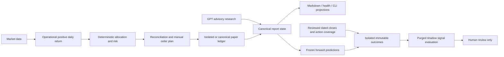

# Meridian Alpha Phase 4 acceptance and recovery checkpoint

## STATUS

**PARTIAL_COMPLETE — engineering checkpoint, not financial alpha validation.**
Verified new contracts and deterministic signal evaluation are implemented.
Predeclared horizon portfolio/cost evaluation is now implemented. Continuous
portfolio valuation, sealed native-role ablation and qualified real comparison
samples remain outstanding. No ten-hour execution
claim is made. Work began 2026-10-08 03:45 UTC (11:45 Asia/Shanghai); exact final
duration and delivery checks are recorded at final handoff. This checkpoint was
recorded at 2026-10-08 05:27 UTC after approximately 1.7 hours elapsed wall time;
this is not a ten-hour effective-work claim.

## BASELINE / FINAL HEAD

Start: `414d8698a905b14eaea558490a5f30d995d07b9d`, fetched and matched to
`origin/codex/canonical-truth-hardening`. Default branch `main` was five commits
behind that development branch. Raw baseline CI logs confirmed Windows 730
passed and Ubuntu 728 passed plus two platform skips. A new independent remote
baseline clone reproduced **727 passed, three failed** in 99.19 seconds because
offline acceptance used closed-market wall time. The new clock fixture repairs
those failures; gates were not relaxed.

Prior validated code HEAD: `98c1d6353ea3282175817bcf951aa22048cceaec`.
Resumed portfolio code HEAD: `0e019447e2b930c38a143a18f46b103ae8d1e7c7`.
Latest validated code HEAD: `8af89527b0305dbfea1ace77d3f0439bbdd9856b`.
Final delivery HEAD is the branch tip containing this report/checkpoint; remote
verification is recorded separately to avoid a self-referential commit hash.

## BRANCH / COMMITS

`feature/forward-evidence-alpha-lab-20261008`, based on the existing development
branch. Remote: `https://github.com/SiriZhao/meridian-alpha.git`. No main merge or
historical rewrite.

- `ffa7922`: deterministic offline clock, workspace temp and worktree isolation.
- `e84ad0e`: reviewed forward close adapter, isolated alpha laboratory and tests.
- `bd2e6dd`: actual decision attribution, canonical/health/Markdown projections.
- `09e95dd`: audit/soak/documentation and resumable checkpoint.
- `b6fbbeb`: revalidate archived review digests, fixed arithmetic context and
  strict typing for all three new laboratory modules.
- `98c1d63`: Linux process exit race observed in PR CI, with four deterministic
  injections; permission/other I/O errors remain fail-closed.
- Final evidence/checkpoint commit follows the validated code commits.

## ACTUAL WORK COMPLETED

Reviewed forward, historical, corporate action, calendar, daily allocation/risk/
reconciliation/order and research authorization paths; reviewed ADR 0032–0034,
raw CI logs, current docs and all fetched origin-ref history patterns. Added
typed close review/ingestion, deterministic challengers, temporal purge and
descriptive paired signal evaluation. Added 59 laboratory/attribution regressions
and four deterministic process-identity failure injections. Preserved the
concurrent quant-engine worktree. Archive readers reject tampered review digests;
laboratory arithmetic uses an explicit precision/rounding/trap context, including
an unavailable result for unrepresentable returns.

## CANONICAL SAFETY

Schwab-Paper / PAPER, broker submission DISABLED, LLM authority ADVISORY_ONLY,
automatic promotion DISABLED. No canonical runtime write, reset, report
replacement, cache mutation, credential discovery or HSBC access. The only
canonical-state operations were read-only aggregate forward-evidence and paper
receipt inspections. The forward file's SHA-256 remained unchanged after work.
Public quotes remain BLOCKED for execution certification.

## FORWARD CLOSE ADAPTER

`DatedClose` validates symbol, 2026–2028 defined session close, USD price,
source/publication/receipt timestamps, origin and adjustment basis.
`ReviewedPricePair` binds prediction, inception, asset/benchmark closes and action
coverage to a digest and manual receipt. Public downloads and synthetic fixtures
never qualify by provider name. Late delivery is valid only after availability,
receipt and review. The read-only module CLI reconciles v1/v2 ledgers and retains
legacy unverified outcomes instead of hiding them.

## CORPORATE ACTION SUPPORT

Split/reverse split and cash/special dividend have chronological share-and-cash
holding-period semantics, without reinvestment. Asset and benchmark need full
coverage. Unknown adjustments, same-instant event ambiguity, unresolved symbol
change, suspension and delisting block return calculation. No inferred terminal
distribution or fabricated delisting price. Manual coverage remains a trust
attestation, not an authenticated official-feed certificate.

## FORWARD EVIDENCE STATUS / SAMPLE SUFFICIENCY

At read-only cutoff 2026-10-08 04:38 UTC: **40 predictions, 16 matured, 16
unverified outcomes, 24 pending, zero verified/reviewed outcomes**. All predictions
had session maturity and benchmark inception; all LLM scores were null.
Sixteen reviewed close receipts were missing. No qualifying data was imported.
Status **INSUFFICIENT_EVIDENCE**; no evaluation eligibility or promotion.
Symbol/horizon row count is not independent temporal or portfolio sample count.

## NO_ACTION ROOT-CAUSE ANALYSIS

Operational raw score is `max(0, daily_return)`, confidence is deterministic 1.
GPT consultation does not modify the operational score/target. Allocation caps
positions without redistributing unused capacity; all operational symbols share
the explicit unclassified risk sector. Tests demonstrate positive quant signals
can lose all allocation under that aggregate sector cap. Other demonstrated
causes: nonpositive signal, incomplete limit-price inputs, cash reserve, whole
shares and minimum notional. Traces record actual branches and risk violations.
Read-only inspection found 18 paper receipts: 11 PAPER_BLOCKED, two waiting for
market, two PAPER_NO_TRADE and three duplicate-execution receipts. These are
receipts, not 18 independent completed daily runs. Eight recorded NO_ACTION and
eight BLOCKED_STALE_MARKET; the older receipts lack per-symbol attribution.
Historical NO_ACTION dominant cause remains NOT_VERIFIED; no fabricated
counterfactual or claim that successful GPT invocation changed quantities.

## ALPHA CHALLENGERS / BASELINE VS CHALLENGER

Fixed cash, exact operational score, 21-consecutive-session multi-factor and
quant plus existing certified research modifier. All are isolated signal
experiments without orders or authority. Missing/irregular/unknown-adjustment
history refuses multi-factor output; uncertified/absent LLM contributes zero.
Recipe, data/research digests and experiment digest are recorded. Six structured
daily-decision scenarios compared against the independent original baseline
produced **identical financial decisions**, including targets and order drafts.

## RESEARCH ABLATION

Laboratory scoring itself makes zero model calls. One bounded native schema
smoke used only a public NYSE calendar document, no quote/account/canonical
payload: gpt-5.6-luna, low effort, SUCCESS, schema valid, one attempt and one
shared invocation of 27,780 ms for four logical roles. It is not grounded alpha
research certification or a role ablation. Token usage/cost UNKNOWN because
usage metadata was absent. Native role-to-lab sealed ablation integration is
outstanding; Fundamental, Skeptic and Scenario comparative datasets are NOT_RUN.
An initial canonical-payload diagnostic was rejected before execution by
automatic approval review; the safe public-only replacement was approved.
No canonical payload was sent. No independent role timing or
confidence-as-probability is fabricated.

## WALK-FORWARD VALIDATION / LOOKAHEAD / SURVIVORSHIP AUDIT

Implemented label availability purge, strict cutoff rejection, ex-ante experiment
and fixed-universe timestamp checks, matching frozen baseline score, common
asset/benchmark/horizon and complete cross-sections. Deterministic overlap purge
is tested. Registration/universe times are caller attestations; no authenticated
registry or market-wide historical membership proof exists. Calendar scope is
explicitly bounded; exceptional older closures are not certified. Non-overlap
alone does not prove time-series independence. The resumed stage below adds
predeclared horizon portfolio/cost partitions. Continuous valuation, rolling
inference and authenticated registration remain unfinished.

## EVALUATION RESULTS / DATA QUALITY

**NO_DEMONSTRATED_ALPHA / INSUFFICIENT_EVIDENCE.** Real financial sample count is
zero. Rank correlation and directional hit rate are descriptive signal metrics,
tested with mock review fixtures. No portfolio cumulative/annualized return,
Sharpe, turnover, drawdown, uncertainty interval or strategy ranking is claimed.
Missing execution/cost assumptions remain NOT_EVALUABLE. Ordinary research
confidence is not a probability, so Brier/ECE is NOT_APPLICABLE.
See [the evaluation report](2026-10-08-quant-vs-llm-shadow-evaluation.md).

## PERFORMANCE / SLO / RESEARCH COST & LATENCY

Sixteen offline fixture cycles across the autumn DST transition covered uptrend,
drawdown, sideways, incomplete quote, stale market/account and zero/small capital.
Zero failures/unexpected exceptions; repeat decisions and report projections
matched. Recorded individual total/report-persistence latency, traced current
216030 bytes and peak 298309 bytes on the final repeat. These are bounded fixture
measurements, not
production latency/SLO or a memory trend. Native public-document schema latency
was 27.780 seconds; provider retrieval/production latency and token/cost
benchmarks remain NOT_MEASURED/UNKNOWN. No optimization speedup claimed.

## TEST RESULTS / END-TO-END ACCEPTANCE / RELIABILITY

Final code host validation: **793 passed**, 87.56 seconds; Ruff PASS,
Pyright 0 errors/0 warnings (basic repository coverage plus strict new laboratory
modules), dependency integrity PASS, CLI PASS. Fifty-nine new lab/attribution
cases plus four process-identity injections include receipt tampering, exact maturity, dividend/split,
missing/unknown/unresolved evidence, timestamp corruption, crash/retry,
cross-process writer contention, holidays/DST, temporal purge and projections.
Existing failure-injection suites remain included. Safe paper acceptance PASS
under optimized Python: NO_ACTION/zero fills and a clearly synthetic fill
fixture, duplicate ownership, complete report bundle and fresh-process check.
No skip/xfail/assertion weakening; three baseline tests gained an explicit
first-run PAPER_READY assertion. Pyright basic excludes scripts and cannot prove
runtime data quality; scripts also received executable smoke checks. Earlier
Ubuntu PR CI exposed an ESRCH race while reading a terminated child's stat file.
The narrow fix accepts confirmed exit; EACCES/EIO still propagate. No retry, skip
or relaxed child-cleanup assertion hides the failure.

## FRESH CLONE

Baseline independent GitHub clone/lock installation completed; baseline clock
failures recorded above. New-branch GitHub clone used Python 3.12.10 and frozen
uv.lock (48 installed packages), its own environment/runtime/cache and no
source-worktree imports. The clone initially validated b6fbbeb (789 passed),
then fetched/fast-forwarded cleanly to final code 98c1d63: **793 passed in 90.19
seconds**, dependency/Ruff/Pyright/CLI/safe-paper/fresh-process/report consistency
PASS. Independent lab CLI score and reconcile PASS; synthetic financial sample
count zero. Windows packaging smoke PASS. UV under sandbox initially hit cache/
PE ACL failures; authorized host installation into an isolated workspace cache
succeeded. No production runtime fallback. Final documentation-only delivery ref
is verified at handoff and must retain this validated code unchanged.

## CI

Raw baseline run [37672422195](https://github.com/SiriZhao/meridian-alpha/actions/runs/37672422195)
was successful on Windows/Ubuntu. The two Ubuntu skips are explicitly Windows
PowerShell 5 launcher and Windows packaging tests; Windows executes both.
Final code push CI [37732028445](https://github.com/SiriZhao/meridian-alpha/actions/runs/37732028445)
and stacked PR CI [37732032239](https://github.com/SiriZhao/meridian-alpha/actions/runs/37732032239)
both succeeded for 98c1d63. Raw push logs: Windows **793 passed** in 53.61 seconds;
Ubuntu **791 passed, two platform skips** in 28.05 seconds. Both ran static,
dependency, CLI, safe acceptance, 21 manual-authority negative cases, eight
replay-integrity cases and skill archive validation. Windows packaging PASS.
Earlier PR failure [37729405520](https://github.com/SiriZhao/meridian-alpha/actions/runs/37729405520)
is retained as evidence for the fixed Linux exit race. Final documentation-ref
CI is checked separately at handoff.

## GITHUB / PR / REMOTE READ-WRITE

Repository public and default branch main verified through GitHub. Fetch/clone
read access and normal push permission PASS. Remote matched local 98c1d63.
Draft stacked [PR #2](https://github.com/SiriZhao/meridian-alpha/pull/2) has base
`codex/canonical-truth-hardening`; main/base branches remain untouched. Final
documentation-tip remote/clone verification is recorded at handoff. No automatic
merge, force push or sensitive repository permission change.

## SECURITY REVIEW

Final read-only audit scanned 1918 objects / 1144 blobs across fetched origin refs.
No high-risk token/private-key pattern finding. Two raw-account-field matches
are test fixture files. Seven historical blobs contain personal absolute paths,
including an old tracked temporary test report. Current tracked files contained
no personal-path match. Pattern scanning is not proof of no secret; findings
were fingerprinted without printing matched values. Manual privacy review is
recommended; no visibility change, secret-store access or history rewrite.

## UNRESOLVED RISKS / LIMITATIONS & BLOCKERS

Real qualified close/action/research comparison data unavailable; continuous
portfolio valuation, native ablation and full production observability soak unfinished.
Review and experiment registration rely on local human attestations. No new
canonical approved-host daily acceptance was requested/executed in this phase:
**NOT_VERIFIED**. Ten-hour mission remains incomplete; use the
[machine-readable checkpoint](2026-10-08-phase4-checkpoint.json) to resume.

## PRODUCTION POLICY CHANGES

**NONE.** No allocation, scoring, threshold, sizing, risk limit, quote authority
or broker permission change. New observations/projections and isolated research
contracts only. Structured baseline comparison passed for six financial paths.

## REAL BROKER SIDE EFFECTS

**NONE.** No broker order/fill/mutation, credential discovery, canonical account
reset, holdings inference or production report replacement. Synthetic fixtures
remain confined to task-created temporary runtimes.

## NEXT DEVELOPMENT PRIORITIES / REQUIRED ANSWERS

1. Stable engineering baseline: validated source, independent clone, Windows/
   Ubuntu CI and push PASS. This does not complete the full research mission.
2. Objective current-strategy investment evaluation: **INSUFFICIENT_EVIDENCE**;
   descriptive framework exists, qualified portfolio outcomes do not.
3. Pure Quant vs Quant+LLM real comparison: **INSUFFICIENT_EVIDENCE**, no real
   reviewed samples or scored LLM cohort.
4. Long NO_ACTION: observed candidate branches listed above; historical dominant
   frequency **NOT_VERIFIED**.
5. Formal production strategy optimization: **NO**; complete reviewed evidence,
   predeclared portfolio evaluation and ablations first. Shadow experiments may
   continue without promotion.

Mission answers: A research-contract checkpoint PASS with listed limitations;
B real positive alpha INSUFFICIENT_EVIDENCE; C reviewed outcomes can accumulate
conditionally through isolated manual receipts, automatic production ingestion
NOT_VERIFIED; D new canonical host acceptance NOT_VERIFIED; E broker side effects
NONE; F validated stable engineering baseline PASS. Financial evaluation and
the ten-hour mission remain incomplete; continue from the explicit task queue.

## RESUMED MISSION — DEVELOPMENT WORK COMPLETED

Continuation started from local/remote 98c1d63 with only the prior agent's pending
report/checkpoint modifications. Those were preserved. The base development
branch remains 414d869, five commits ahead of main; draft PR #2 remains stacked
on that base. No main merge, force push, user branch deletion or runtime mutation.
New code commits: af821ce (portfolio contracts/CLI/ADR 0036/cutoff fix) and 0e01944
(precise benchmark cash arithmetic). Final evidence-only delivery tip is the
branch ref, avoiding a self-referential hash in this document.

### ALPHA / RESEARCH EVALUATION AND BASELINE VS CHALLENGER

Added the predeclared horizon portfolio laboratory: fixed universe, unchanged
risk policy snapshot, chronological train/validation/test partitions and fixed
commission/slippage grid. Shared complete cohorts include cash, matched-horizon
buffered benchmark, operational quant, fixed multi-factor and certified-research
quant. The existing allocator/risk overlay is reused in isolation; production
scoring/thresholds/weights/risk/order logic were not modified.

Returns charge entry and terminal costs, require cash funding, retain distribution
cash and expose period weights/net return/cost/traded notional. Metrics include
held-out cumulative/matched-benchmark excess return, endpoint drawdown, horizon
volatility, exposure, concentration, hypothetical transaction count and cost
sensitivity. Missing train/validation/test evidence yields null metrics. No
parameter fitting, retrospective winning-strategy selection or promotion.

This is a hypothetical fractional horizon model, not continuous buy-and-hold,
observed fills or an integer order simulation. Gap cash interest is assumed zero;
exit cost on terminal wealth is a declared conservative approximation. There are
no intra-horizon observations or serial-dependence uncertainty claims. Full
rolling walk-forward inference and sealed role ablations remain outstanding.
See [portfolio lab](../portfolio-lab.md) and [ADR 0036](../adr/0036-predeclared-horizon-portfolio-evaluation.md).

### LOOKAHEAD / SURVIVORSHIP AUDIT

Fixed an actual cutoff integration gap: both evaluators now require feature as-of
to equal frozen information cutoff, even when decision time is later. Training
labels unavailable before validation and validation labels unavailable before
test are purged; overlapping held intervals are removed. Conflicting benchmark
source receipts reject a block even if numeric returns happen to match. Mock
review tests demonstrate refusal of public/synthetic origins, missing cohorts,
delayed labels, duplicate identities and post-hoc registration.

Registration/review remain human attestations. Historical universe membership,
older exceptional closures and delisted-terminal distributions are incomplete;
scope remains a predeclared fixed universe and reviewed 2026-2028 sessions.

### SAMPLE SUFFICIENCY AND FINANCIAL CONCLUSION

No new real qualified samples were imported and no new canonical inspection is
claimed. The earlier dated snapshot above remains historical evidence. This
resume used zero real comparison samples and zero LLM invocations. Financial
conclusion remains INSUFFICIENT_EVIDENCE / NO_DEMONSTRATED_ALPHA. Missing certified
research contributes zero and prevents a sufficient LLM comparison claim.

### RESEARCH COST / LATENCY AND RELIABILITY

Five bounded synthetic mock-review portfolio replays were identical: median
63.305 ms, range 60.840-68.156 ms with tracemalloc enabled; traced peak 511515
bytes. Retained traced bytes grew from 87610 to 132534 across this short sample;
that is neither evidence of long-run stability nor a diagnosed leak. Sixteen
existing offline scenario cycles passed with zero failures. Production SLO,
provider latency and native-model costs are NOT_MEASURED this resume. No model
calls or optimization speedup claimed; prior public-only smoke is dated above.

### TEST COUNTS / END-TO-END ACCEPTANCE

Final code source validation: 807 passed in 110.51 seconds. Dependency integrity,
Ruff, basic Pyright plus strict four lab modules, CLI, optimized safe paper,
canonical/health/Markdown consistency and fresh-process acceptance PASS. Fourteen
new portfolio regressions include exact fee arithmetic, cash insolvency, corrupt
nonfinite inputs, deterministic decimal contexts, common cohorts, information
cutoff, benchmark provenance and read-only fresh-process CLI/Markdown identity.
Total increase from original 730 baseline: 77 tests, not financial samples.

Failures are retained: restricted execution produced 792 passed/one Windows
child-cleanup failure; the exact approved-host test and full host suite passed.
A development-time full run produced 805 passed/one projection mismatch because
the source was changed while parent/child were running; that mixed-version run
was discarded, code frozen and full validation passed. No assertion relaxation,
test removal, new skip or xfail was used.

### CI / GITHUB / SECURITY

Code push [37742987387](https://github.com/SiriZhao/meridian-alpha/actions/runs/37742987387)
and stacked PR [37742993808](https://github.com/SiriZhao/meridian-alpha/actions/runs/37742993808)
PASS for 0e01944. Raw push logs: Windows 807 passed (56.35 seconds), Ubuntu 805
passed/two Windows-only skips (41.76 seconds). Manual-authority 21 cases, replay
integrity eight cases, package validation and Windows packaging PASS. Public
visibility reverified; no sensitive repository permissions changed.

Resumed read-only history scan before the new push: 1918 objects/1144 blobs,
zero high-risk token/private-key patterns, two fixture account-field matches and
seven historical personal-path blobs. Pattern scanning is not proof of absence
of all secrets. Human privacy assessment remains; no history rewrite or secret
store access was attempted.

### SECURITY / BROKER INVARIANTS AND REQUIRED ANSWERS

A. Bounded, reviewed research-contract use: PASS with declared hypothetical model
and attestation limitations; broad financial certification NOT_VERIFIED.
B. Real evidence of positive alpha: INSUFFICIENT_EVIDENCE.
C. Verified outcomes can accumulate through reviewed isolated immutable ingestion:
fixture-tested PASS; unattended real collection and sufficient samples NOT_VERIFIED.
D. New canonical approved-host paper daily acceptance: NOT_VERIFIED; this resume
used isolated offline runtimes only.
E. Real broker/real-trading side effects: NONE. Schwab-Paper/PAPER, broker DISABLED,
LLM execution authority NONE, quote certification BLOCKED, automatic promotion
DISABLED; no account reset, holdings inference or HSBC access.
F. Stable engineering baseline: code/static/full tests/latest dual-platform CI
PASS; independent clone and final delivery are recorded below when completed.

The full ten-hour research mission remains PARTIAL_COMPLETE. The quota gap is
not effective work. Next: qualified close/action and certified research cohorts,
continuous portfolio paths, rolling uncertainty/ablations and observed operational
evidence. Production strategy optimization is not justified by these fixtures.

### RESUMED FRESH CLONE / FINAL DELIVERY CHECKPOINT

Independent GitHub clone at 0e01944 used Python 3.12.10, uv 0.12.7, frozen uv.lock
and 48 freshly installed project packages in its own environment/uv cache.
PYTHONPATH was cleared and runtime/cache were clone-local. Full validation:
**807 passed in 122.60 seconds**, dependencies/Ruff/Pyright/CLI/safe paper,
fresh-process/report consistency PASS. Windows packaging PASS; clone worktree
clean and tested code HEAD matched source/remote. An extra, redundant no-cache
uv bootstrap download stalled and was cancelled; the earlier successfully
installed pinned bootstrap and frozen project environment remained intact.
That cancelled download is not reported as PASS.

Final code HEAD 0e01944 is pushed and matches remote. The evidence-only delivery
commit follows; final tip remote/clone SHA and tip CI are checked at handoff.
The final resumed public-ref scan covered 1943 objects/1156 blobs with the same
two fixture-field and seven personal-path findings, no high-risk token/key
pattern. This is bounded pattern review, not a proof of no secret.

Resume first observed at 07:05 UTC; this evidence checkpoint is approximately
07:34 UTC, about 29 elapsed minutes since that observation. Prior checkpoint
recorded 6124 elapsed seconds in its earlier segment. Effective engineering
hours are not measured; the quota interruption is not work and there is no
ten-hour completion claim. Source and fresh-clone code are validated; financial
evidence, native ablations and the remaining research mission are not complete.

### FINAL CI-OBSERVED EXIT-STATE REPAIR AND ACCEPTANCE

The documentation-tip push CI succeeded, but PR run
[37744349982](https://github.com/SiriZhao/meridian-alpha/actions/runs/37744349982)
failed on Ubuntu: the original timeout cleanup test found a child's stat identity
after termination (804 passed, one failed, two platform skips). This failure was
not hidden by the parallel successful push or a rerun. Review found that Linux
identity parsing ignored the process state and returned start time even for
retained exited entries. [Linux kernel documentation](https://www.kernel.org/doc/html/latest/filesystems/proc.html)
defines zombie state separately from running/sleeping tasks.

Commit 8af8952 treats confirmed Z/X/x as exited, matching the Windows terminated
handle behavior. Active states stay live; truncated/non-numeric stat is explicitly
unverifiable, and permission/EIO uncertainty still fails closed. Eleven new
deterministic injections run on both platforms, including names containing
parentheses. No change to timeout, kill behavior, financial gates or assertions.

Latest code validation: **818 passed in 119.26 seconds** in source and **818
passed in 123.10 seconds** in the independent frozen-lock clone. All dependency,
Ruff/Pyright, CLI, safe paper, fresh-process and report-consistency checks PASS.
Targeted identity plus portfolio: **29 passed**. This resume added 25 tests
(14 portfolio, 11 identity); original baseline increase is 88, not sample count.

Code push [37744891605](https://github.com/SiriZhao/meridian-alpha/actions/runs/37744891605)
and PR [37744897281](https://github.com/SiriZhao/meridian-alpha/actions/runs/37744897281)
both PASS at 8af8952. Raw push logs: Windows **818 passed** (54.67 seconds), Ubuntu
**816 passed/two Windows-only skips** (41.84 seconds). Both include the unchanged
real subprocess cleanup regression, negative manual-authority and replay tests.

The final evidence-only tip follows this validated code; final source/remote/
clone SHA and tip workflows are checked at handoff. This overrides earlier test
counts and delivery claims in the historical checkpoint sections above. Full
research mission remains PARTIAL_COMPLETE; financial alpha remains
INSUFFICIENT_EVIDENCE / NO_DEMONSTRATED_ALPHA, canonical host daily NOT_VERIFIED,
production policy unchanged and real broker side effects NONE.
