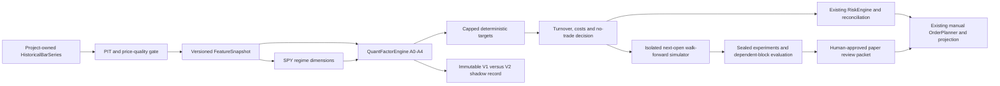

# Quant Engine V2 architecture

`quant/features.py` consumes existing historical contracts; it hashes actual
eligible prices and lineage, not bar identities alone. `signals.py` reports
each contribution, rank, completeness, risk adjustment, inclusion/exclusion and
prior score change. `regime.py` binds SPY state to the same cutoff.
`portfolio.py` builds existing `TargetPortfolio` objects and friction decisions.
`backtest.py` simulates independent whole-share holdings with next-open fills;
`metrics.py` evaluates returns and statistical uncertainty. `experiments.py`
seals the dataset, parameters, costs, risk and engine implementation before OOS.
`version.py` fingerprints implementation and reused deterministic safety modules.
`numerics.py` pins 28-digit ROUND_HALF_EVEN arithmetic and default traps at
public quant entrypoints, restoring the caller's Decimal context afterward.

`integration.py` supplies opt-in shadow observations and a non-executing paper
review function. `DailyClosureService.run` can attach shadow output, while its
default V1 decision remains unchanged. The application passes the histories
already retrieved for the same snapshot. There is no extra canonical ledger,
order execution system, broker authority or migration.

The quant CLI routes before creating `MeridianApplicationService` and only reads
explicit dataset/plan files. Experiment outputs may not enter the canonical
runtime. JSON contracts are under `schemas/quant-*`; default parameters are
under `policies/quant.yaml` and are included in built packages.

The separate forward-evidence and alpha-lab surfaces continue to measure
advisory/reviewed outcomes. Their row counts are not converted into portfolio
sample sizes or used to promote V2 automatically.

Adjusted archival research uses CERTIFIED_RESEARCH_PIT_ADJUSTED. Existing raw
market certification and execution quote eligibility remain disjoint. No public
provider certifies itself through this new contract. Expected SPY session gaps
and unverified final marks block replay. Paper review requires metadata for both
held and target symbols, then validates sector exposure after order planning.
`scripts/validate_quant_artifacts.py` checks all five generated contracts and
the complete published synthetic registry as part of repository validation.
